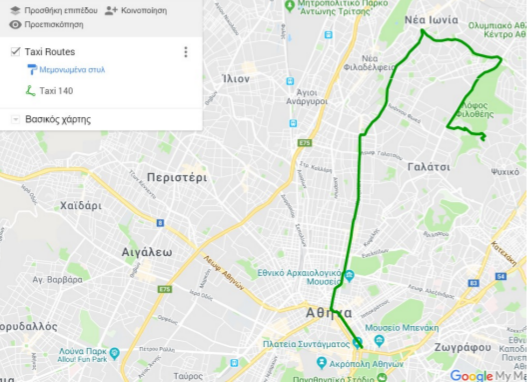

## Taxi-Navigation-System-NTUA :taxi: :taxi:
The prime aim of this project was to build on the first part a Java implementation of the A* algorithm and use it on a specific problem setup.  
The problem refers to the taxis of Athens city and the need of an algorithm that will find the optimal (i.e. fastest) route for each taxi in order to pick up a client. When a client needs a taxi the algorithm based on the taxis' positions will call the closest taxi in order to pick up the client so that the waiting time will be reduced.  

In order to perform that A* AI algorithm was developed in Java and on the second part this algorithm was combined with Prolog via *Jiprolog* in order to integrate Prolog with Java. We have used prolog in order to incorporate more criteria in order to find the optimal taxi (such as traffic, road conditions etc.).  

In order to visualize the results we have used Google Maps.  

## Optimal Route displayed in Google Maps (after Prolog integration)

